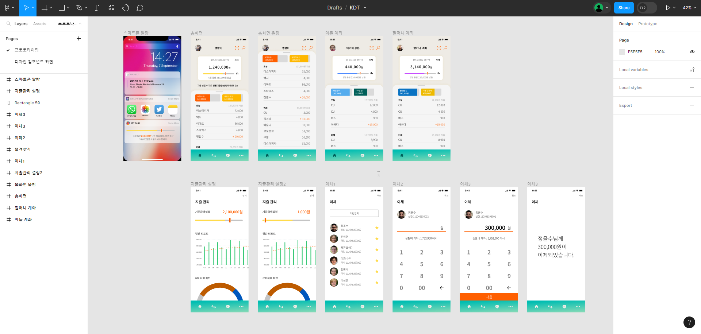

<h1>프로젝트 기본 구성과 마크업</h1>
<h2 style="color: #002266">STEP 1. 프로젝트 생성</h2>
계좌 화면은 다음 구성으로 이루어진다.
 

    

<h2 style="color: #002266">STEP 1. 프로젝트 생성</h2>

<h2 style="color: #002266">STEP 1. 프로젝트 생성</h2>
